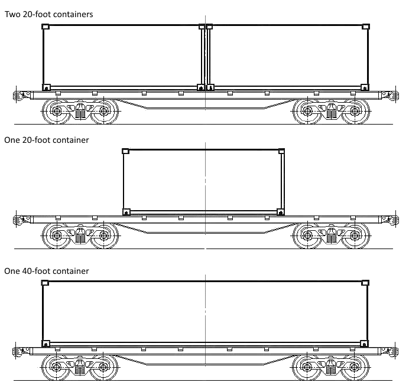
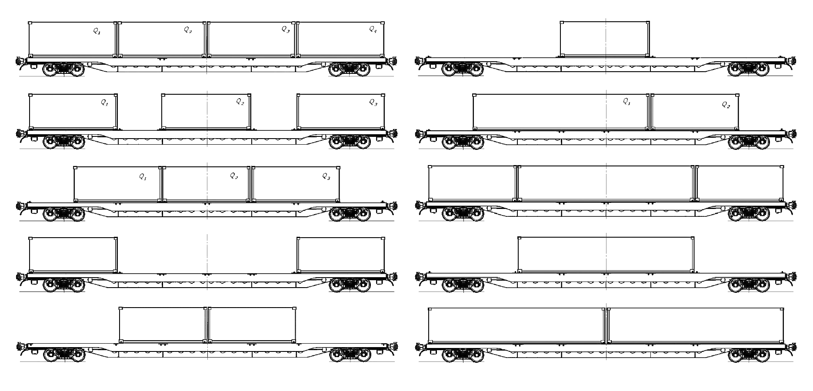
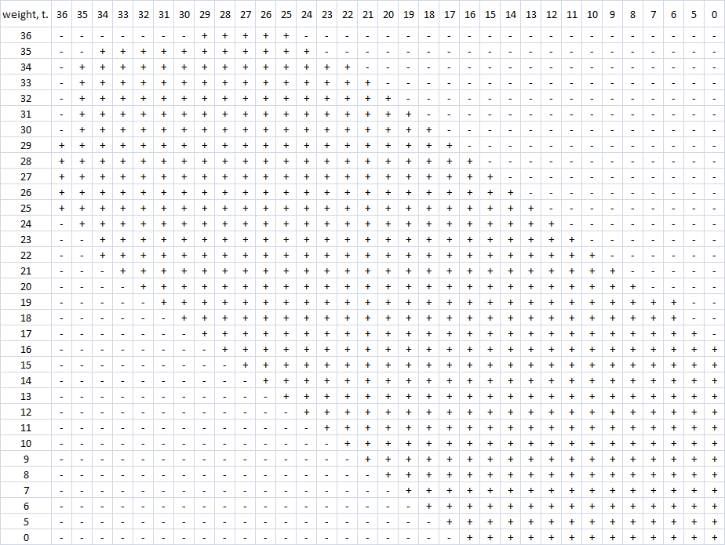

# Train load
Freight railcars load planning application. Variation of [bin packing problem](https://wikipedia.org/wiki/Bin_packing_problem), a combinatorial [NP-hard](https://wikipedia.org/wiki/NP-hardness) problem.

## Background
    Here we have a train, consisting of two types rail cars (known as well cars) - 40-foot and 80-foot, and number of intermodal containers - 20-foot and 40-foot. The question is if it's possible to load all the given containers into the given rail cars and the order to do it.  
    Possible variants of loading 40-foot car:  
  
  
    In 80-foot car we can load up to four 20-foot or two 40-foot containers with any combinations, like only one 20-foot container or two 20-foot with one 40-foot and so on:  
  
  
    All the combinations depend on the strict rules, according to containers count per car, position on the car, each container weight and weight difference between all the loaded containers in a car. So, for example, if we have loaded one 20-foot container, it doesn't mean what we can add another one 20-foot (it will depend on their total weight and weight difference between them). Same, if we have two 20-foot containers loaded, it doesn't mean what we can simply remove one of them.  
    This is an example of compatibility of two 20-foot containers with 40-foot car:  
  
  
    In compare with ordinary bin packing problem, here we have more dimensions which define whether container can be loaded or not.  
    
## Solution
    We use two different approaches here. First one is brute-force enumeration of all possible combinations of containers. But with that we can load only a limited (and actually small) amount of cars in a train. Based on tests here the limit is 15 cars. If we take more, the calculation can take minutes, hours and much more in exponential time. So while the cars amount is more than 15 there is a second approach - we are iteratively calculating the best car load combination with available containers and cars, and throw it out from the set. For every container we are calculating probability of occurrence container in all possible combinations. The less that parameter, the better to load that container at first. If we have several variants of car load with container with the lowest probability - then we just sort it by weight, the bigger, the better.
    
## Building
    You need [Visual Studio 2017](https://www.visualstudio.com/) to build this project

## Usage
    Available cars and containers should be present in "containers.txt" file. Solution goes to "out.txt".